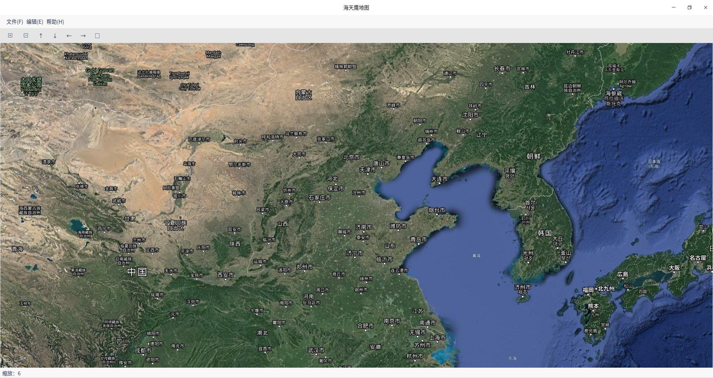

# 海天鹰地图
基于 Qt 的地图软件，导入 gpx 轨迹显示。  
已编译好的 HTYMap 适用于 64 位 Linux 系统 Qt5.11 环境。
 
 
### 绘图原理
偶然发现经纬度求差值再放大可以显示轨迹形状
### 参考
[DOM读写增删改](https://blog.csdn.net/u012234115/article/details/43203001)  
[栅格瓦片坐标计算](https://mp.weixin.qq.com/s?__biz=MzAwNDk4MTg3Mg==&mid=2247483661&idx=1&sn=4248dc1fa9f97094527903330f1c11a6)
### 已知问题
* 中心、移动有误差。
* 图片未加载完移动、缩放会崩溃。